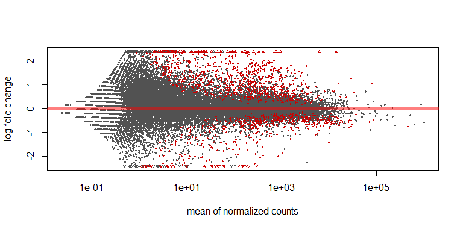
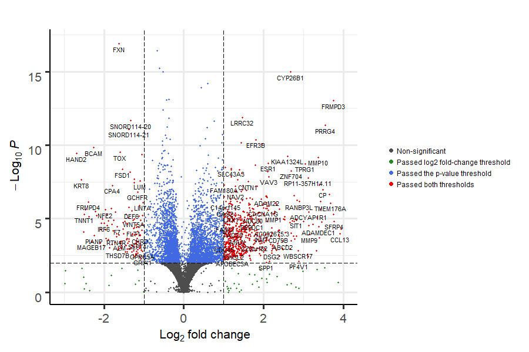
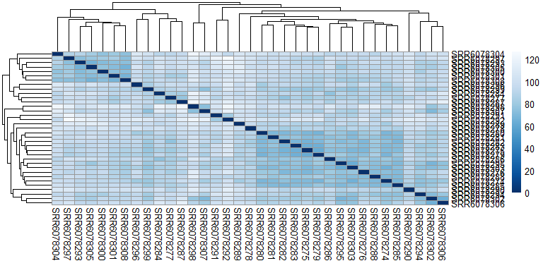
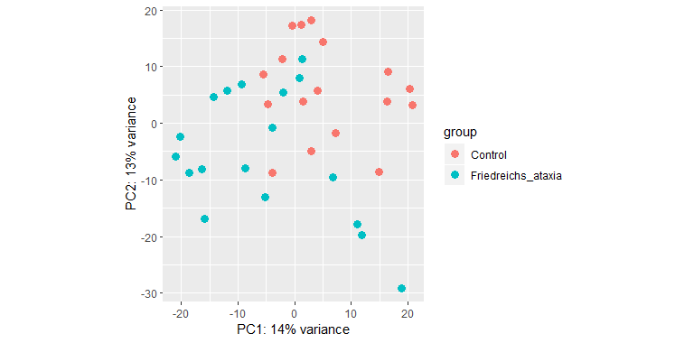
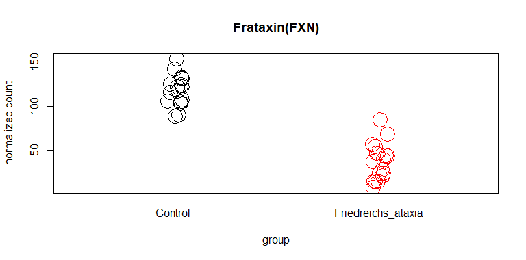

# Bioinformatics Analysis Results

From my analysis, I have identified 4676  significant Differentially Expressed Genes (**DEGs**) [2693 (up_regulated) + 1983 (down_regulated)] between the Friedreich’s Ataxia (**FRDA**) group (18 samples) and Control (**CTRL**) group (17 samples) (FDR<0.05); whereas the authors in ([Napierala et al., 2017](https://www.ncbi.nlm.nih.gov/pubmed/29125828)) have identified only 3788 **DEGs**.  

The authors in ([Napierala et al., 2017](https://www.ncbi.nlm.nih.gov/pubmed/29125828)) used fibroblast cell lines in their sequencing experiment. They should have used nerve or heart cells because these cells are the most defective ones in **FRDA**. Even then, I am still able to find significantly differentiated genes between the two groups. Interestingly, antioxidant genes were downregulated in **FRDA** cells.  

Compared with the **CTRL** group (samples), the **FRDA** group shows a direct and significant downregulation in the expression of the frataxin gene (**FXN**). **FXN** has an average expression in **FRDA** samples that is equivilant to 32 % of the average expression in **CTRL** samples  (**DESeq2** calculated the corresponding **log2FoldChange** to be equal to -1.62).

Moreover, in comparison with the **CTRL** group (samples), the **FRDA** group showed a direct and significant downregulation of expression of three antioxidant genes: **NQO1**, **TXN2** and **PRKAG1**. In addition, the downregulation of **PRKAG1** leads to the indirect downregulation of several other antioxidant genes  (like **SOD** and **HO-1**) because **PRKAG1** is involved in their expression.  

**Table1** shows the directly and significantly down-regulated antioxidant genes. The third column (log2FoldChange) shows the log base-2 of the fold-change in the average expression in **FRDA** samples when compared with the average expression in **CTRL** samples . Whereas the fourth column (Percentage of Controls(%)) shows the percentage of the average expression in **FRDA** samples of the average expression in **CTRL** samples. For example, **NQO1** has an average expression in **FRDA** samples that is equivilant to 66 % of the average expression in **CTRL** samples.

**Table1**: The directly and significantly down-regulated antioxidant genes.  

Gene          |          Name                                  | log2FoldChange | Percentage of Controls (%)
------------- | ---------------------------------------------- | ------------------ | ----------------------  
**NQO1**      | NAD(P)H Quinone Dehydrogenase 1                  | -0.59 | 66
**TXN2**      | Thioredoxin-2                                    | -0.17 | 89
**PRKAG1**    | 5'-AMP-activated protein kinase subunit gamma-1  | -0.21 | 86

---------

### MA-plot
A scatter plot of log2 fold changes (on the y-axis) versus the mean of normalized counts (on the x-axis).

### Volcano-plot
A scatter plot that shows statistical significance (P value) versus magnitude of change (**fold-change**). It enables quick visual identification of genes with large fold changes (high **fold-change**) that are also statistically significant (low **p-value**). These may be the most biologically significant genes. In a volcano plot, the most upregulated genes are towards the right, the most downregulated genes are towards the left, and the most statistically significant genes are towards the top. Fold-change calculates the average expression in **FRDA** samples w.r.t the average expression in **CTRL** samples.  

For example, FXN is in the left-top corner of the plot. **FXN** has log2 **fold-change** equal to -1.62 (i.e. the average expression in **FRDA** samples is equivilant to 32 % of the average expresslion in **CTRL** samples).  

### Heatmap-plot
A Heatmap plot gives us an overview over the similarities and the dissimilarities between samples.  

### PCA-plot
Principl Components Analysis (PCA) is used to visualize the sample-to-sample distances. 

### Plot-count of FXN gene

Plot of normalized counts of **FXN**.

----------
P.S: Visit the [Clinical Significance and Therapuetic Potential](Clinical_Significance_and_Therapuetic_Potential.md) page next.
----------

# References

- Napierala, J. S., Li, Y., Lu, Y., Lin, K., Hauser, L. A., Lynch, D. R., & Napierala, M. (2017). Comprehensive analysis of gene expression patterns in Friedreich’s ataxia fibroblasts by RNA sequencing reveals altered levels of protein synthesis factors and solute carriers. Disease Models & Mechanisms, 10(11), 1353–1369. https://doi.org/10.1242/dmm.030536
